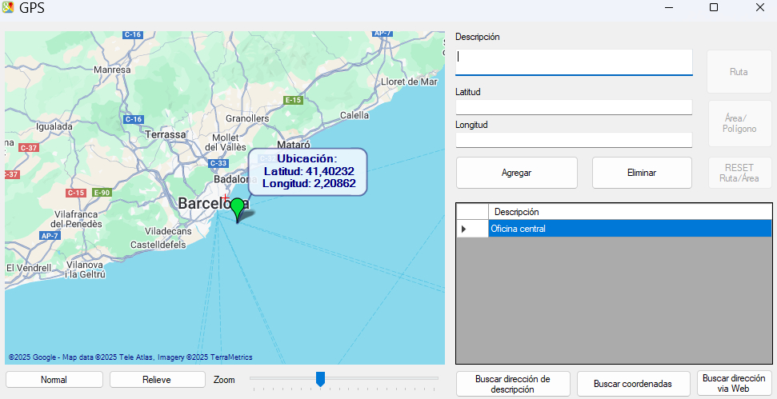

# 🛰️ GPS-NETFramework

Una aplicación de escritorio desarrollada en **C#** con **.NET Framework** que permite la lectura y visualización de datos GPS. 

## 🚀 Características

- 📡 Lectura de datos GPS.
- 🖥️ Interfaz gráfica intuitiva basada en Windows Forms
- 📝 Registro de datos recibidos para análisis posterior

## 🛠️ Tecnologías utilizadas

| Tecnología       | Descripción                        |
|------------------|------------------------------------|
| C#               | Lenguaje de programación principal |
| .NET Framework   | Plataforma de desarrollo           |
| Windows Forms    | Interfaz gráfica de usuario (GUI)  |
| System.IO.Ports  | Comunicación con puertos serie     |


## ⚙️ Cómo ejecutar el proyecto

1. Clona el repositorio:

   ```bash
   git clone https://github.com/antonicr1986/GPS-NETFramework.git

2.Ejecuta el archivo AntonioWindowsFormsGPS.sln con Visual Studio (preferiblemente 2019 en adelante) que se encuentra en la raiz del proyecto.


## 📷 INTERFAZ PRINCIPAL DE LA APLICACIÓN



